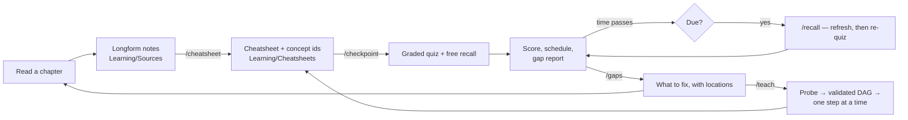

# pi-config

A [pi](https://pi.dev) configuration that turns reading into retained
knowledge: longform notes get compressed into cheatsheets, chapters end in a
graded checkpoint, memory gets refreshed on a schedule before it decays, and
what you keep getting wrong turns into a ranked list of what to fix.

Inspired by [Eero Alvar's *How I Use AI to Learn Things*](https://www.youtube.com/watch?v=kzcI5F4tGiU).

## The idea it is built on

Alvar's argument, in short: normal learning is many-to-many — every outlet
teaches many students, every student learns from many outlets — and both
directions waste effort.

- An outlet built for many minds cannot be optimal for yours. Optimal teaching
  works at **the edge of your understanding**: not reteaching what you hold,
  not presenting what you cannot yet take in.
- Learning from many outlets costs switching, and — the deeper cost —
  **trust**. Your brain hedges on an unfamiliar source; it will not fully
  commit a fact until the source has proven itself. With AI, trust is not built
  over years, it is *engineered*: verification exists so the information is
  right **and** so you can stop hedging.

Which gives the design rule this repo follows: **do not remove difficulty —
relocate it.** Maximise struggle in the material, and let the system absorb
the logistics: what to learn next, in what order, what to compress, what to
verify, when to review, what you are weak at.

## The loop



When reading is not enough — a concept you cannot get from the page, or a
prerequisite a gap report just surfaced — `/teach` runs the live tutoring loop:
probe the edge of what you hold, draw the dependency graph, then teach one
reasoning step at a time with a lock-in quiz after each. What it teaches
becomes a cheatsheet, which puts it back into the same schedule.

Everything lives in your Obsidian vault as plain Markdown. There is no hidden
database: the cheatsheet's frontmatter *is* the schedule, and the ledger is one
append-only JSONL file.

## What it looks like

The whole system, in one screen — setup is below.

```
# after reading, with your own notes in Learning/Sources/
> /cheatsheet Chapter 4 — Differential Forms
  → Learning/Cheatsheets/Differential Forms.md, 11% of the source, 6 concepts

# when you have finished the chapter
> /checkpoint differential-forms
  → free recall, then graded questions in a picker, one at a time
  → 72%. Solid: covector, pullback. Shaky: wedge-product (sign convention)
  → next review in 3 days, gap report written

# for the part the book was no help with
> /teach the wedge product, well enough to compute one
  → probes what I hold, draws the graph, waits
  → then one reasoning step, one lock-in question, repeat

# eight days later, opening pi for anything at all
  ⚠ 1 topic overdue, worst by 5 days. Run /recall.

> /recall
  → cold, so: three lines of spine first, then recall, then targeted questions
  → next review in 9 days

> /gaps
  → 1. `wedge-product` — shaky detail. Redo §4.3 example 2 without the
       solution, then say why the sign flips when you swap the arguments.
```

## Getting started

Never used pi before? Start here — this is the whole path from nothing to your
first quiz, and it takes about ten minutes.

### What you need first

| What | Details | Where to get it |
|---|---|---|
| **Node.js 22.19 or newer** | check with `node --version` | [nodejs.org](https://nodejs.org) |
| **A model subscription or API key** | Claude Pro/Max, ChatGPT Plus/Pro, GitHub Copilot, or an API key from any [provider pi supports](https://github.com/badlogic/pi-mono/blob/main/packages/coding-agent/README.md#providers--models) — this is what does the actual teaching | your provider |
| **Obsidian** | free; where you read, write and see everything | [obsidian.md/download](https://obsidian.md/download) |

Obsidian is not strictly required — everything is plain Markdown in a folder —
but it is what makes maths render, diagrams draw, and links work, so get it.

### Step 1 — Make a vault

Open Obsidian → **Create new vault** → name it something like `Study` and pick
where it lives (e.g. `~/Documents/Study`).

**Write down that folder path.** You need it in step 5.

If you already have a vault you like, use that one — this system keeps
everything inside a single `Learning/` folder and touches nothing else.

### Step 2 — Install pi

In a terminal:

```bash
npm install -g --ignore-scripts @earendil-works/pi-coding-agent
```

Or, if you would rather not use npm:

```bash
curl -fsSL https://pi.dev/install.sh | sh
```

Check it worked:

```bash
pi --version
```

On Windows, use WSL or follow [pi's Windows notes](https://github.com/badlogic/pi-mono/blob/main/packages/coding-agent/docs/windows.md).

### Step 3 — Sign in to a model

Start pi by typing `pi`, then inside it:

```
/login
```

Pick your provider and follow the prompts. If you have an API key instead of a
subscription, quit pi and export it before starting — for example
`export ANTHROPIC_API_KEY=sk-ant-...` — then run `pi` again.

Then pick a model with `/model` (or Ctrl+L). **Use the strongest one you have
access to.** Teaching is the task where model quality shows most: a weaker
model will still ask you questions, but it will explain worse and misjudge
where your edge is.

Type `/quit` to leave pi (or press Ctrl+C twice).

### Step 4 — Install this config

```bash
git clone https://github.com/madhavmenon10/pi-config
cd pi-config
./install.sh
```

That symlinks the skills, prompts and extension into `~/.pi/agent/`, so they
work from **any** folder — you never have to be inside this repo to use them.
It also creates `~/.pi/agent/learn.json` for you.

<details>
<summary>One-line alternative</summary>

```bash
pi install git:github.com/madhavmenon10/pi-config
```

This route does not create the config file, so you have to write it yourself in
step 5.
</details>

### Step 5 — Point it at your vault

Open `~/.pi/agent/learn.json` and set `vault` to the folder from step 1:

```json
{
  "vault": "/Users/you/Documents/Study"
}
```

That single line is the only setting you need — everything else has a sensible
default. (Everything you *can* change is listed under
[Configuration](#configuration).)

### Step 6 — Create the folders

Start pi from anywhere and run:

```
pi
> /learn-init
```

You should see *"Learning folders ready under
/Users/you/Documents/Study/Learning"*. Switch to Obsidian and you will find a
new `Learning/` folder there, with `Dashboard.md` and `LEARNER.md` inside it.
Everything this system ever writes goes in that one folder.

If instead you see *"vault not found"*, the path in step 5 is wrong — fix it
and run `/learn-init` again.

### Step 7 — Tell it who you are

Open `Learning/LEARNER.md` in Obsidian and fill it in. Five honest lines beats
a paragraph of aspiration:

```markdown
## Solid ground
- Two years of undergrad physics, comfortable with vector calculus

## Shaky
- Linear algebra beyond matrices — I can compute, I do not see it

## Notation and conventions
- Physics conventions, index notation is fine

## How I learn best
- Concrete example first, then the general statement

## Current goal
- Get through Chapter 4 of Baez & Muniain by the end of the month
```

This is what stops the system re-explaining things you already hold. It is the
single highest-leverage file in the vault.

**You are set up.** Everything below is how to actually use it.

## Your first session

Two ways in. Pick whichever matches what you are doing right now.

> In the examples below, `pi` is what you type in your terminal, and `>` is
> pi's own prompt — type what comes *after* it, not the `>` itself.

### A. You want to learn a concept — `/teach`

```
pi
> /teach the wedge product, well enough to compute one by hand
```

Here is what happens, in order, so nothing surprises you:

1. **It asks you questions first.** A box appears in your terminal with a
   question and a few answers. Use the **arrow keys** to move, **Enter** to
   choose, **Esc** to dismiss. This is the probe — it is finding where your
   understanding actually stops.

   Always pick **"I don't know"** when you do not know. It is a real answer,
   recorded as an unknown rather than a mistake, and it aims everything that
   follows. Guessing right here will cost you later.

   There is also an **"Explain it in my own words instead"** option if you would
   rather type your reasoning than pick from a list.

2. **It draws you a map and stops.** A file appears in `Learning/Maps/` — open
   it in Obsidian to see a diagram of the route: slate is what you already
   hold, amber is where you start, grey is not reachable yet, blue is where you
   are now. Read it. Say if you want it changed.

3. **Then it teaches one step.** One idea, then it stops and asks you a
   question about that idea. Get it right and the next step opens. Get it
   wrong and it inserts the missing piece into the map and teaches that
   instead. This pacing is deliberate — one step at a time is the part that
   works.

4. **At the end** it offers to turn the session into a cheatsheet. **Say yes.**
   That is what puts the topic into the review schedule; a lesson that never
   becomes a cheatsheet is one you will have lost in three weeks.

Ask questions whenever you like. Interrupting is not rude and does not break
anything — if your question exposes a hole in the plan, it becomes a new step.

Just want to see what a subject involves before committing an afternoon to it?
Use `/plan <goal>` instead: same probe, same map, no teaching.

### B. You have been reading a book — `/cheatsheet` then `/checkpoint`

1. **Take notes as you read**, in Obsidian, in `Learning/Sources/`. Messy is
   correct — full sentences are not the goal. Two things are worth the effort:
   page numbers, and writing down the bits that confused you.

2. **Compress them** when you finish a section:

   ```
   pi
   > /cheatsheet Chapter 4
   ```

   You get a cheatsheet in `Learning/Cheatsheets/` — the spine, the things
   that are easy to confuse, the formulas, the traps. Read it once and fix
   anything wrong; you are the only one who knows what you meant. Anything it
   could not verify is listed at the bottom as an open question rather than
   quietly asserted.

3. **Test yourself** when you finish the chapter:

   ```
   > /checkpoint chapter 4
   ```

   It starts with one open question you answer from memory, then graded
   questions in the picker. At the end you get a score, what is solid, what is
   not, and where to go back to — and your first review gets scheduled.

### After that, it runs itself

Open pi for anything at all, any day, in any folder, and it will tell you when
something has gone stale:

```
⚠ 2 topic(s) overdue, worst by 11 days. Run /recall.
```

Type `/recall` and it handles the rest — topics that have gone properly cold
get their spine re-taught before you are tested on them, so you are never just
staring at a blank. `/gaps` any time you want to know what to fix next.

You never have to decide what to review or keep track of what is decaying.
That is the whole point: the effort goes into the material, not the admin.

[docs/workflow.md](docs/workflow.md) goes deeper on each of these — including
the handful of habits that decide whether the whole thing works for you or
quietly stops being used.

### If something goes wrong

| What you see | What it means |
|---|---|
| `no .pi/learn.json` | Step 5 was skipped — create `~/.pi/agent/learn.json` with a `vault` line |
| `vault not found at ...` | The path in `learn.json` is wrong. `~/Documents/Study` is fine as a shortcut, but the rest must match exactly — the message tells you the path it tried |
| `quiz needs an interactive session` | You ran pi with `-p` or piped input. The quiz is a terminal dialog — just run `pi` on its own |
| `No cheatsheet found for "..."` | Nothing to quiz yet. Run `/cheatsheet` first, or `/teach` and let it make one |
| `/teach` explains everything at once | Wrong model, or it skipped the plan. Check `/model` is on the strongest one you have |
| Commands like `/teach` do not appear | The install did not take — re-run `./install.sh`, then `/reload` inside pi (or restart it) |
| Nothing appears in Obsidian | Obsidian shows the vault you opened. Check the folder in `learn.json` is the same one |

## Commands

| Command | What it does |
|---|---|
| `/teach <goal>` | Live tutoring: probe → dependency graph → one reasoning step at a time |
| `/plan <goal>` | Probe and draw the graph only — see what a concept will take before starting |
| `/cheatsheet [note]` | Compress a longform note into a cheatsheet with concept ids |
| `/checkpoint <topic>` | End-of-chapter quiz → score → gaps → next review scheduled |
| `/recall [topic]` | Spaced review of whatever has gone stale, refreshing cold topics first |
| `/gaps [topic]` | Ranked knowledge-gap report, each ending in a concrete action |
| `/due` | What is due, and refresh the dashboard note |
| `/learn` | Status: vault, topic count, weakest concepts, where this session is logged |
| `/learn-init` | Create the vault folder structure |
| `/log [note]` | Mirror this session into a specific Obsidian note |
| `/skill:verify` | Fact-check a set of claims before they become something you trust |

## Tools the agent gets

| Tool | Purpose |
|---|---|
| `quiz` | One graded multiple-choice question in an interactive picker. Shuffles options, appends "I don't know", grades against the key, records the result |
| `recall_free` | Open, no-options recall — you type from memory, the agent grades it |
| `recall_score` | Record the grade for a free answer |
| `learn_plan` | Write the teaching DAG as a mermaid diagram — and reject it if it does not hold together |
| `learn_plan_update` | Lock a node after its quiz passes, or insert a prerequisite when it fails |
| `learn_due` | Topics due, overdue, or never quizzed, and which have gone cold |
| `review_close` | Score the session, apply the schedule, write it into the cheatsheet |
| `learn_gaps` | Per-concept accuracy and every miss, from the ledger |

The `quiz` tool exists because a quiz you answer in chat is one you can bluff.
The picker makes you commit before you see whether you were right, "I don't
know" is a first-class answer rather than a guess, and the option order is
shuffled so the model cannot leak the answer by always putting it first.

`learn_plan` exists for the same kind of reason. The graph is genuinely useful
to look at — you can see the whole day's path, what you already hold, and what
each step buys you before committing to any of it. But its other job is to stop
the model improvising: the plan has to **validate**. Every dependency must name
a node that exists, the graph must be acyclic, ids must be unique, and there
must be a real starting point in ground you already hold. A graph that fails is
rejected with the reason, and nothing is written. You cannot produce a valid
dependency graph for a subject by pattern-matching your way through it — you
have to have actually worked out the order, which is exactly the reasoning that
gets skipped when an explanation is improvised a paragraph at a time.

The plan note stays live: nodes flip to locked as their quizzes pass, anything
newly reachable is promoted automatically, and a failed lock-in inserts the
missing prerequisite into the graph where you can see it. You can also edit the
table in Obsidian yourself — mark something `known` and the system believes you.

## Vault layout

```
<vault>/Learning/
├── Dashboard.md            generated — what is due, what is weak
├── LEARNER.md              what the system should assume about you
├── Sources/                your longform reading notes (you write these)
├── Cheatsheets/            compressed, quizzable, one per topic
├── Sessions/               transcript of every learning session, LaTeX rendered
├── Gaps/                   ranked gap reports
├── Maps/                   teaching plans (live mermaid DAGs) and diagrams
└── .state/recall.jsonl     append-only answer history
```

## How the scheduling works

Each cheatsheet carries its own schedule in frontmatter — `ease`,
`interval_days`, `reps`, `lapses`, `last_quizzed`, `next_review`, `mastery` —
updated by `review_close`, never by hand. The algorithm is SM-2 with the
session score standing in for the recall grade: pass and the interval
multiplies by ease; fail and it drops to a day and ease takes a hit, so a topic
you keep dropping keeps coming back.

Two things fall out of that, and they are the point:

- **You never decide what to review.** Every pi session checks and tells you if
  something is overdue, wherever you happen to be working.
- **Cold topics get re-taught, not just tested.** Once a topic is well past due,
  quizzing a blank is slow and demoralising, so `/recall` gives you the spine
  back first and then tests it.

## Configuration

`~/.pi/agent/learn.json` (or `.pi/learn.json` per project; `$LEARN_VAULT`
overrides the path). Copy `.pi/learn.example.json` and edit. Notable knobs:

| Key | Default | Meaning |
|---|---|---|
| `vault` | — | Absolute path to your Obsidian vault. Required |
| `scheduler.passScore` | `0.7` | Session score at or above which a review passes |
| `scheduler.coldFactor` | `2` | How far past due before a topic is re-taught, not just quizzed |
| `scheduler.unquizzedNudgeDays` | `3` | Days before a never-quizzed cheatsheet starts nagging |
| `revealDuringProbe` | `false` | Whether probe questions show the answer immediately |
| `autoLogSessions` | `true` | Mirror learning sessions into `Sessions/` |
| `dashboardOnStart` | `true` | Refresh the dashboard whenever a session starts |

Nothing is written to the vault until a learning tool is actually used, and
nothing at all if the configured vault path does not exist.

## Development

```bash
npm test    # node --experimental-strip-types .pi/extensions/learn/selftest.ts
```

The self-test covers config loading, frontmatter round-tripping (unmanaged keys
and nested tag lists must survive), the ledger, the schedule, and the
dashboard. It needs no pi runtime and no npm install.

See [docs/workflow.md](docs/workflow.md) for the day-to-day workflow and
[docs/design.md](docs/design.md) for why things are the way they are.

## Credit

The method — probe the edge, plan as a graph, teach one step, lock it in with a
quiz — is Eero Alvar's, from [*How I Use AI to Learn
Things*](https://www.youtube.com/watch?v=kzcI5F4tGiU). `/teach` and `/plan`
implement that loop; the rest of this repo extends it to reading and retention,
adding compression, spaced review, and gap analysis.

The `quiz` tool is named to match what
[Alvarmethod](https://github.com/vasanthsreeram/Alvarmethod) expects on pi, so
its skills work against this harness too. Note that it also ships a skill
called `teach` — pi keeps the first of a colliding name and warns, so install
one or the other, not both.
