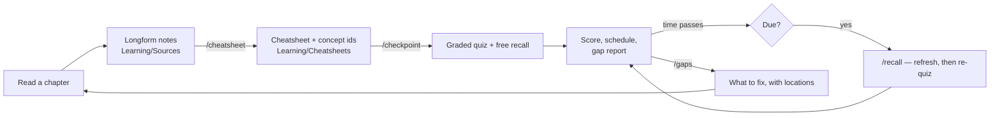

# pi-config — an Obsidian learning system for the pi agent

A [pi](https://pi.dev) configuration that turns reading into retained
knowledge: longform notes get compressed into cheatsheets, chapters end in a
graded checkpoint, memory gets refreshed on a schedule before it decays, and
what you keep getting wrong turns into a ranked list of what to fix.

Inspired by [Eero Alvar's *How I Use AI to Learn Things*](https://www.youtube.com/watch?v=kzcI5F4tGiU).

## The idea it is built on

Alvar's argument, in short: normal learning is many-to-many — every outlet
teaches many students, every student learns from many outlets — and both
directions waste effort.

- An outlet built for many minds cannot be optimal for yours. Optimal teaching
  works at **the edge of your understanding**: not reteaching what you hold,
  not presenting what you cannot yet take in.
- Learning from many outlets costs switching, and — the deeper cost —
  **trust**. Your brain hedges on an unfamiliar source; it will not fully
  commit a fact until the source has proven itself. With AI, trust is not built
  over years, it is *engineered*: verification exists so the information is
  right **and** so you can stop hedging.

Which gives the design rule this repo follows: **do not remove difficulty —
relocate it.** Maximise struggle in the material, and let the system absorb
the logistics: what to learn next, in what order, what to compress, what to
verify, when to review, what you are weak at.

## The loop



Everything lives in your Obsidian vault as plain Markdown. There is no hidden
database: the cheatsheet's frontmatter *is* the schedule, and the ledger is one
append-only JSONL file.

## Install

```bash
pi install git:github.com/madhavmenon10/pi-config
```

Or clone and symlink into `~/.pi/agent` so you can keep editing it:

```bash
git clone https://github.com/madhavmenon10/pi-config
cd pi-config && ./install.sh
```

Then point it at your vault and lay out the folders:

```bash
$EDITOR ~/.pi/agent/learn.json    # set "vault"
pi                                 # run from anywhere
> /learn-init
```

`/learn-init` creates `Learning/` in the vault with a dashboard and a
`LEARNER.md` stub. Fill in `LEARNER.md` — it is what stops the system from
re-explaining things you already know.

Requires an interactive pi session (the quiz picker is a TUI dialog).

## A day in the life

```
# after reading, with your own notes in Learning/Sources/
> /cheatsheet Chapter 4 — Differential Forms
  → Learning/Cheatsheets/Differential Forms.md, 11% of the source, 6 concepts

# when you have finished the chapter
> /checkpoint differential-forms
  → free recall, then graded questions in a picker, one at a time
  → 72%. Solid: covector, pullback. Shaky: wedge-product (sign convention)
  → next review in 3 days, gap report written

# eight days later, opening pi for anything at all
  ⚠ 1 topic overdue, worst by 5 days. Run /recall.

> /recall
  → cold, so: three lines of spine first, then recall, then targeted questions
  → next review in 9 days

> /gaps
  → 1. `wedge-product` — shaky detail. Redo §4.3 example 2 without the
       solution, then say why the sign flips when you swap the arguments.
```

## Commands

| Command | What it does |
|---|---|
| `/cheatsheet [note]` | Compress a longform note into a cheatsheet with concept ids |
| `/checkpoint <topic>` | End-of-chapter quiz → score → gaps → next review scheduled |
| `/recall [topic]` | Spaced review of whatever has gone stale, refreshing cold topics first |
| `/gaps [topic]` | Ranked knowledge-gap report, each ending in a concrete action |
| `/due` | What is due, and refresh the dashboard note |
| `/learn` | Status: vault, topic count, weakest concepts, where this session is logged |
| `/learn-init` | Create the vault folder structure |
| `/log [note]` | Mirror this session into a specific Obsidian note |
| `/skill:verify` | Fact-check a set of claims before they become something you trust |

## Tools the agent gets

| Tool | Purpose |
|---|---|
| `quiz` | One graded multiple-choice question in an interactive picker. Shuffles options, appends "I don't know", grades against the key, records the result |
| `recall_free` | Open, no-options recall — you type from memory, the agent grades it |
| `recall_score` | Record the grade for a free answer |
| `learn_due` | Topics due, overdue, or never quizzed, and which have gone cold |
| `review_close` | Score the session, apply the schedule, write it into the cheatsheet |
| `learn_gaps` | Per-concept accuracy and every miss, from the ledger |

The `quiz` tool exists because a quiz you answer in chat is one you can bluff.
The picker makes you commit before you see whether you were right, "I don't
know" is a first-class answer rather than a guess, and the option order is
shuffled so the model cannot leak the answer by always putting it first.

## Vault layout

```
<vault>/Learning/
├── Dashboard.md            generated — what is due, what is weak
├── LEARNER.md              what the system should assume about you
├── Sources/                your longform reading notes (you write these)
├── Cheatsheets/            compressed, quizzable, one per topic
├── Sessions/               transcript of every learning session, LaTeX rendered
├── Gaps/                   ranked gap reports
├── Maps/                   diagrams and dependency graphs
└── .state/recall.jsonl     append-only answer history
```

## How the scheduling works

Each cheatsheet carries its own schedule in frontmatter — `ease`,
`interval_days`, `reps`, `lapses`, `last_quizzed`, `next_review`, `mastery` —
updated by `review_close`, never by hand. The algorithm is SM-2 with the
session score standing in for the recall grade: pass and the interval
multiplies by ease; fail and it drops to a day and ease takes a hit, so a topic
you keep dropping keeps coming back.

Two things fall out of that, and they are the point:

- **You never decide what to review.** Every pi session checks and tells you if
  something is overdue, wherever you happen to be working.
- **Cold topics get re-taught, not just tested.** Once a topic is well past due,
  quizzing a blank is slow and demoralising, so `/recall` gives you the spine
  back first and then tests it.

## Configuration

`~/.pi/agent/learn.json` (or `.pi/learn.json` per project; `$LEARN_VAULT`
overrides the path). Copy `.pi/learn.example.json` and edit. Notable knobs:

| Key | Default | Meaning |
|---|---|---|
| `vault` | — | Absolute path to your Obsidian vault. Required |
| `scheduler.passScore` | `0.7` | Session score at or above which a review passes |
| `scheduler.coldFactor` | `2` | How far past due before a topic is re-taught, not just quizzed |
| `scheduler.unquizzedNudgeDays` | `3` | Days before a never-quizzed cheatsheet starts nagging |
| `revealDuringProbe` | `false` | Whether probe questions show the answer immediately |
| `autoLogSessions` | `true` | Mirror learning sessions into `Sessions/` |
| `dashboardOnStart` | `true` | Refresh the dashboard whenever a session starts |

Nothing is written to the vault until a learning tool is actually used, and
nothing at all if the configured vault path does not exist.

## Development

```bash
npm test    # node --experimental-strip-types .pi/extensions/learn/selftest.ts
```

The self-test covers config loading, frontmatter round-tripping (unmanaged keys
and nested tag lists must survive), the ledger, the schedule, and the
dashboard. It needs no pi runtime and no npm install.

See [docs/workflow.md](docs/workflow.md) for the day-to-day workflow and
[docs/design.md](docs/design.md) for why things are the way they are.

## Credit

The method — probe the edge, plan, teach one step, lock it in with a quiz —
is Eero Alvar's, from [*How I Use AI to Learn
Things*](https://www.youtube.com/watch?v=kzcI5F4tGiU). This repo applies it to
reading and retention rather than live tutoring, and adds compression, spaced
review, and gap analysis on top. The `quiz` tool is named to match what
[Alvarmethod](https://github.com/vasanthsreeram/Alvarmethod)'s `teach` skill
expects on pi, so the two work together.
